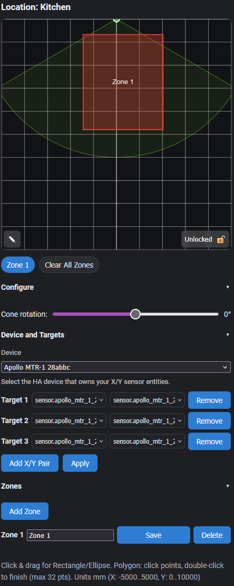

# Zone Mapper Lovelace Card


A custom Lovelace card for Home Assistant that lets you draw 2D detection zones over a grid and visualize tracked targets (for example, mmWave sensor targets). The card talks to the Zone Mapper backend integration, which persists the zones and exposes per‑zone occupancy sensors you can use in automations.

> [!WARNING]
> This integration requires the Zone Mapper backend integration for functionality. Install it from HACS or from [the repository.](https://github.com/ApolloAutomation/zone-mapper-card)

## Features

- Draw, update, and clear zones of multiple shapes: rectangle, ellipse, polygon
- Polygon drawing tools: double‑click to finish, Backspace to undo last vertex, Esc to cancel
- Polygon capped at 32 vertices (auto‑finishes at limit)
- Zones and rotation persist across Home Assistant restarts (restored from sensor attributes)
- Presence binary_sensors per zone using tracked X/Y entities
- Color‑coded zones and target dots; targets are rotated by the device angle for a consistent view
- Mobile‑friendly drawing (mouse + touch supported)
- Configurable grid ranges (default X: −5000..5000 mm, Y: 0..10000 mm; Y increases downward)
- Helper overlay (device “view cone”) with configurable horizontal FOV and rotation angle
- Compact UI:
  - Bottom‑left: a single ✎ “Draw” button toggles a vertical menu of modes (▭ Rect, ◯ Ellipse, ⬠ Polygon) that appears above it
  - Bottom‑right: 🔒 Lock toggle prevents accidental edits (disables drawing and cancels in‑progress)
  - Device and Entity pickers: choose a HA device and select X/Y sensor entity pairs directly from dropdowns; click Apply to persist
- Multi‑unit support (front‑end only): configure input/grid in mm, cm, m, in, or ft (backend remains millimetres)
- Adaptive, unit‑aware grid spacing with readable “nice” steps
- Optional unit labels on axes (unit_display), with configurable font size (unit_label_size)
- Smart display units: mm grids label in metres; inch grids label in feet
- Device cone range rings and labels when unit_display is enabled: every 1 m (metric) or 4 ft (imperial)
- Caching of grid lines/labels and cone rings to reduce redraw work during drags/slider moves

## Requirements

- Home Assistant 2025.9.4+ recommended
- [Zone Mapper backend integration](https://github.com/ApolloAutomation/zone-mapper) installed
- Sensor entities providing numeric X and Y coordinates for one or more targets

## Installation

There are two ways to install this lovelace card. Both this card and [the backend integration](https://github.com/ApolloAutomation/zone-mapper) **must** be installed

### With HACS (Recommended)

HACS is like an app store for Home Assistant. It makes installing and updating custom cards much easier. Here's how to install using HACS:

- **Install HACS if you don't have it:**

  - If HACS is not installed yet, download it following the instructions on [https://hacs.xyz/docs/use/download/download/](https://hacs.xyz/docs/use/download/download/)
  - Follow the HACS initial configuration guide at [https://hacs.xyz/docs/configuration/basic](https://hacs.xyz/docs/configuration/basic)

- **Add this custom repository to HACS:**

  - Go to `HACS` in your Home Assistant sidebar
  - CLick on the 3 dots in the upper right corner
  - Click "Custom repositories"
  - Add this URL to the repository: [https://github.com/ApolloAutomation/zone-mapper-card](https://github.com/ApolloAutomation/zone-mapper-card)
  - Select `Dashboard` for the type
  - Click the `ADD` button

- **Install Zone Mapper:**

  - Go to `HACS` in your Home Assistant sidebar
  - Search for `Zone Mapper` in HACS
  - Click on the card when you find it
  - Click the `Download` button at the bottom right
  - Repeat for backend integration

### Manual Installation

1. Copy the card file to your `www` folder:

    - `/config/www/zone-mapper-card.js`

2. Add the resource in Settings → Dashboards → Resources:

    - URL: `/local/zone-mapper-card.js`
    - Type: `JavaScript Module`

3. Refresh your browser cache (Control/Command + Shift + Reload).

## Backend integration

The Zone Mapper integration exposes a single service and creates two entity types per zone:

- Coordinate sensor: `sensor.zone_mapper_<slug(location)>_zone_<id>`
  - Attributes: `shape`, `data`, `entities`, and `rotation_deg`
  - The card reads these to restore zones and rotation on load
- Presence binary sensor: `<location> Zone <id> Presence` (device class: Occupancy)

Shape data formats:

- Rect: `{ x_min, x_max, y_min, y_max }`
- Ellipse: `{ cx, cy, rx, ry }`
- Polygon: `{ points: [ { x, y }, ... ] }`

To clear a zone, send `data: null` (or `shape: none`).

## Card configuration

### Yaml Configuration

The majority of the configuration and management of zones takes place on the actual card interface. Location name, theme, grid sizing, and units are handled in the yaml:

```yaml
type: custom:zone-mapper-card
location: Office  # friendly name shown on card; used to build zone entity ids
dark_mode: false

# Units (front-end only, converts to mm internally)
input_units: mm     # mm | cm | m | in | ft
grid_units: mm      # mm | cm | m | in | ft
unit_display: false  # show unit-aware axis labels and cone ring labels
unit_label_size: 18 # optional px (8..24)

# Zones can be managed in-card; you can optionally pre-seed a list here:
# zones: [ { id: 1, name: 'Zone 1' } ],

# Grid (units; Y‑down: y_min is top, y_max is bottom)
grid:
  x_min: -6000
  x_max: 6000
  y_min: 0
  y_max: 12000

# Device cone
device_cone:
  y_max: 6000     # max range (radius) to display, in units
  fov_deg: 120    # total horizontal FOV in degrees (e.g., 120 => ±60°)
  angle_deg: 0    # initial rotation (-180..180); persisted and used for presence math
```

### Using The Card



#### Setting Target Entities

1. Click `Configure` drop-down
2. Click `Device and Targets` drop-down
3. Select your device
    - Entities attempt to auto-populate based off of device
    - Entities can be manually configured for device
    - For `Helper`-type entities that aren't associated with a `device` leave device selection as default —Select device— and use `Add X/Y Pair` to select entities
4. Click `Apply` to save selection.

#### Zone Management

1. Click `Configure` drop-down
2. Click `Zones` drop-down
3. Click `Add Zone`
4. Name your new zone
5. Click `Save` to confirm your new zone
    - Zones and their paired entities can be deleted here
    - Zones can also be removed by restarting Home Assistant after removing the card and deleting from entities list

#### Drawing Zones

1. Select a zone via its button.
2. Click ✎ to reveal modes; choose ▭ Rect / ◯ Ellipse / ⬠ Poly.
3. For Rect & Ellipse: click/touch and drag to define the bounding box; release to save.
4. For Polygon: click to place vertices; double-click or click ✓ button to finish. Backspace and ↺ button removes the last vertex; Esc cancels the in-progress polygon.
    - Max 32 points; reaching the limit auto-finishes the polygon.
5. Double-click a zone button to clear just that zone (sends `data: null`).
6. Use “Clear All Zones” to clear every configured zone. This does not delete entities
7. Toggle 🔒 to lock/unlock drawing.
8. Target dots are drawn in different colors using the current X/Y sensor values and are rotated by the current angle.
9. Rotate the device fov cone with the slider (−180..180).
    - Target positions rotate in-line with cone adjustment
    - Double click slider handle to reset rotation to default defined with `angle_deg`
    - This also updates backend `rotation_deg` and persists across restarts. The cone displays ±(fov_deg/2). Adjust `cone.y_max` for displayed range.

## Troubleshooting

- First, make sure you click `Save` and `Apply` after setting up the card or making any changes

- “Resource not found”:
  - Confirm the resource URL is `/local/zone-mapper-card.js` and the file is under `/config/www`.
  - Clear your browser cache.
- Zones don’t persist:
  - Check the coordinate sensor attributes for `shape`, `data`, and `rotation_deg`
  - Ensure `zone_mapper.update_zone` is being called (Developer Tools → States/Logs)
- Coordinate entity not found:
  - Draw a zone once to initialize entities for the location
- Presence sensors never turn on:
  - Verify tracked X/Y entity states are numeric (not `unknown`/`unavailable`).
  - Confirm the point lies within the drawn zone (correct shape & coordinates).
- Targets dots are staying on card/triggering automations even though I have left the view:
  - This is currently an issue with many ld2450 mmWave sensors using espHome, not related to Zone Mapper.

## Example Automation

Zone Mapper creates simple binary presence entities for each location and zone. These can be quickly turned into automations using Home Assistant workflows:

```yaml
mode: restart
max_exceeded: silent
triggers:
  - trigger: state
    entity_id: binary_sensor.office_zone_1_presence
    from: "off"
    to: "on"
actions:
  - alias: Turn on the light
    action: light.turn_on
    target:
      entity_id: light.office_1
    data: {}
  - alias: Wait until there is no motion from device
    wait_for_trigger:
      trigger: state
      entity_id: binary_sensor.office_zone_1_presence
      from: "on"
      to: "off"
  - alias: Wait the number of seconds that has been set
    delay: 120
  - alias: Turn off the light
    action: light.turn_off
    target:
      entity_id: light.office_1
    data: {}
alias: Office Light Control
description: ""
```

## Notes

- Entities are created on first update for a location; draw a zone once to initialize
- Coordinates are rounded to the nearest millimeter by the backend

- The `location` is slugified using Home Assistant's rules (lowercase, punctuation removed, accents stripped, spaces → underscores) to locate coordinate sensors: `sensor.zone_mapper_<slug(location)>_zone_<id>`
- Example: `location: "Office"` → `sensor.zone_mapper_office_zone_1`

## Unit semantics

- The backend persists all geometry in millimetres using a Y‑down coordinate system (increasing Y goes down)
- The card converts between your configured input_units/grid_units and mm automatically
- Axis labels shorten mm→m and in→ft for legibility

## Mobile and touch support

- The canvas supports touch gestures (press, drag, lift) to draw zones.
- The card disables native touch scrolling on the canvas so you can draw without the page moving.
- If you can tap buttons but can’t draw, ensure you start the drag inside the canvas and lift to finish; also check whether another view/container intercepts gestures.

## Service contract

Single service: `zone_mapper.update_zone`.

Payload fields:

- location: string (required)
- zone_id: number (optional for zone updates; omit for angle‑only update)
- shape: 'none' | 'rect' | 'ellipse' | 'polygon' (optional; 'none' clears)
- data: object | null (optional; null clears the zone)
- rotation_deg: number (optional; −180..180; updates location angle when provided)
- entities: list of `{ x, y }` entity id pairs (optional; replaces tracked entities for presence)

Examples:

Clear a zone:

```yaml
service: zone_mapper.update_zone
data:
  location: Office
  zone_id: 1
  shape: none
  data: null
```

Update only rotation (no zone change):

```yaml
service: zone_mapper.update_zone
data:
  location: Office
  rotation_deg: -15
```

Update a rectangle and tracked entities:

```yaml
service: zone_mapper.update_zone
data:
  location: Office
  zone_id: 2
  shape: rect
  data: { x_min: -500, x_max: 500, y_min: 500, y_max: 1500 }
  entities:
    - { x: sensor.device_target_1_x, y: sensor.device_target_1_y }
    - { x: sensor.device_target_2_x, y: sensor.device_target_2_y }
```

## Development

- The card is a vanilla JS Web Component; no build step is required.
- Edit `zone-mapper-card.js` and hard refresh your dashboard.
- The backend is a standard Home Assistant custom component (binary_sensor + sensor platforms, custom services).
